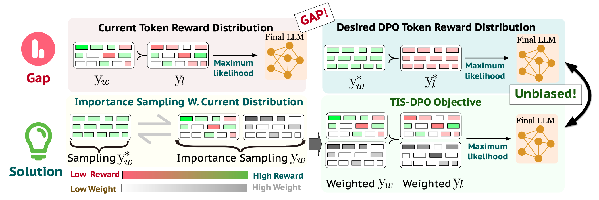

# TIS-DPO: Token-level Importance Sampling for Direct Preference Optimization With Estimated Weights

<div align="center">

[](https://arxiv.org/abs/2410.04350)
[](https://openreview.net/forum?id=oF6e2WwxX0)
[](https://opensource.org/licenses/Apache-2.0)
[](https://www.python.org/downloads/)
[](https://huggingface.co/datasets/exlaw/tis-dpo-data)
[](https://huggingface.co/exlaw/Qwen2.5-3B-sft)

</div>

## 📌 Table of Contents
- [Overview](#🔍-overview)
- [Installation](#🔧-installation)
- [Dataset Preparation](#📊-dataset-preparation)
- [Model Preparation](#🤖-model-preparation)
- [Training Pipeline](#🚀-training-pipeline)
  - [Step 1: Training DPO and Reverse DPO Models](#step-1-training-dpo-and-reverse-dpo-models)
  - [Step 2: Token Weight Estimation](#step-2-token-weight-estimation)
  - [Step 3: Training with TIS-DPO](#step-3-training-with-tis-dpo)
- [Repository Structure](#📝-repository-structure)
- [Acknowledgements](#🙏-acknowledgements)
- [Citation](#📄-citation)
- [License](#📜-license)

## 🔍 Overview

<div align="center">

</div>

TIS-DPO enhances Direct Preference Optimization by incorporating token-level importance sampling. While standard DPO treats the entire response as a single unit, TIS-DPO recognizes that not all tokens contribute equally to response quality. 

Our approach assigns importance weights to each token based on its estimated reward, focusing optimization on the most critical parts of the response. These weights are estimated using the difference in prediction probabilities from a pair of contrastive LLMs trained with forward and reverse DPO.

## 🔧 Installation

Create and activate the conda environment:

```bash
conda env create -f environment.yml
conda activate tis-dpo
```

## 📊 Dataset Preparation

Download the required dataset from [Hugging Face](https://huggingface.co/datasets/exlaw/tis-dpo-data):

```bash
huggingface-cli download --resume-download exlaw/tis-dpo-data --local-dir datasets --repo-type=dataset
```

The data should be organized in the `datasets/` directory.

## 🤖 Model Preparation

This repository uses the [Qwen2.5-3B](https://huggingface.co/Qwen/Qwen2.5-3B) model as an example. 

Download our fine-tuned starting model:

```bash
huggingface-cli download --resume-download exlaw/Qwen2.5-3B-sft --local-dir models/Qwen2.5-3B-sft
```

This model has been trained on the Alpaca dataset to provide instruction following capabilities.

## 🚀 Training Pipeline

### Step 1: Training DPO and Reverse DPO Models

Train the standard DPO model:

```bash
python -u train.py model=qwen model.name_or_path=models/Qwen/Qwen2.5-3B-sft \
  datasets=[ultra-feedback] loss=dpo loss.beta=0.1 \
  gradient_accumulation_steps=2 batch_size=32 eval_batch_size=32 \
  trainer=FSDPTrainer sample_during_eval=false \
  base_data_dir=datasets/ reverse_dataset=false
```

The resulting model will be saved at `output/dpo_Qwen2.5-3B-sft_ultra-feedback_{timestamp}`

Train the reverse DPO model:

```bash
python -u train.py model=qwen model.name_or_path=models/Qwen/Qwen2.5-3B-sft \
  datasets=[ultra-feedback] loss=dpo loss.beta=0.1 \
  gradient_accumulation_steps=2 batch_size=32 eval_batch_size=32 \
  trainer=FSDPTrainer sample_during_eval=false \
  base_data_dir=datasets/ reverse_dataset=true
```

The resulting model will be saved at `output/dpo_Qwen2.5-3B-sft_ultra-feedback_reverse_{timestamp}`

### Step 2: Token Weight Estimation

First, set the paths to your trained models (replacing `{timestamp}` with the actual values):

```bash
export MODEL_NAME_1="output/dpo_Qwen2.5-3B-sft_ultra-feedback_{timestamp}"
export MODEL_NAME_2="output/dpo_Qwen2.5-3B-sft_ultra-feedback_reverse_{timestamp}"
```

Then run the token weight estimation:

```bash
bash scripts/token_weight_estimation.sh
```

### Step 3: Training with TIS-DPO

Train using the estimated token weights:

```bash
python -u train.py model=qwen model.name_or_path=models/Qwen/Qwen2.5-3B-sft \
  datasets=[ultra-feedback-tisdpo] loss=tisdpo loss.beta=0.1 \
  gradient_accumulation_steps=2 batch_size=32 eval_batch_size=32 \
  trainer=FSDPTrainer sample_during_eval=false \
  base_data_dir=generated-data/ reverse_dataset=false \
  transform.method=rank_based
```

Available transformation methods include:
- `rank_based`
- `random`
- `threshold_and_scale`
- `binary`
- `origin`
- `threshold`

The final model will be saved at `output/tisdpo_Qwen2.5-3B-sft_ultra-feedback_tisdpo_{transform_method}_{timestamp}`

## 📝 Repository Structure

```
.
├── README.md                  # Project documentation
├── LICENSE                    # Apache 2.0 license
├── environment.yml            # Conda environment specification
├── train.py                   # Main training script
├── utils.py                   # Utility functions
├── token_weight_estimation.py # Script for token weight estimation
├── preference_datasets.py     # Dataset loading and preprocessing
├── trainers.py                # Training implementations
├── transform_config.py        # Token weight transformation methods
├── config/                    # Configuration files
│   ├── config.yaml            # Main configuration
│   ├── transform/             # Transformation configurations
│   ├── model/                 # Model configurations
│   └── loss/                  # Loss function configurations
├── scripts/                   # Utility scripts
│   └── token_weight_estimation.sh  # Token weight estimation script
├── models/                    # Directory for storing models
├── datasets/                  # Directory for storing datasets
├── generated-data/            # Directory for storing generated data
└── output/                    # Directory for training outputs
```

## 🙏 Acknowledgements

We would like to thank the authors of [DPO](https://github.com/eric-mitchell/direct-preference-optimization) for their foundational work.

## 📄 Citation

If you find this work useful, please consider citing:

```bibtex
@inproceedings{
liu2025tisdpo,
title={{TIS}-{DPO}: Token-level Importance Sampling for Direct Preference Optimization With Estimated Weights},
author={Aiwei Liu and Haoping Bai and Zhiyun Lu and Yanchao Sun and Xiang Kong and Xiaoming Simon Wang and Jiulong Shan and Albin Madappally Jose and Xiaojiang Liu and Lijie Wen and Philip S. Yu and Meng Cao},
booktitle={The Thirteenth International Conference on Learning Representations},
year={2025},
url={https://openreview.net/forum?id=oF6e2WwxX0}
}
```

## 📜 License

This project is licensed under the Apache License 2.0 - see the [LICENSE](LICENSE) file for details.


